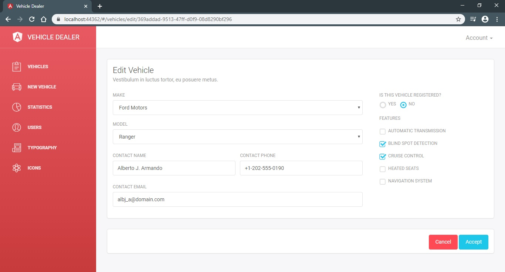

# Vehicle Dealer App with Angular and ASP.NET Core

A vehicle dealer application built with Angular and ASP.NET Core 3.1.

## Technologies
- ASP.NET Core 3.1
- FluentValidation
- Entity Framework Core
- Microsoft SQL Server
- Swagger
- TypeScript
- Angular 9
- Light Bootstrap Dashboard
- Lodash.js
- SweetAlert

## Screenshots

 
 
  

## Resources

- *[Light Bootstrap Dashboard Angular](https://www.creative-tim.com/product/light-bootstrap-dashboard-angular2)*
- *[Entity Framework Tutorial](https://www.entityframeworktutorial.net/efcore/entity-framework-core.aspx)*
- *[Build a Real-world App with ASP.NET Core and Angular](https://www.udemy.com/course/aspnet-core-angular/)*
